# Design

## Class Diagram

## SOLID Principles

### Single Responsibility Principle (SRP)
- Each class has a single responsibility and is responsible for one part of the functionality provided by the software.
- For example, the `Supplier` class is responsible for managing supplier information, while the `Inventory` class is responsible for managing inventory items.
- This separation of concerns makes the code easier to understand, maintain, and test.

### Open/Closed Principle (OCP)
- Classes are open for extension but closed for modification.
- For example, the `Order` class can be extended to create different types of orders (e.g., stock orders, customer orders) without modifying the existing code.

### Liskov Substitution Principle (LSP)
- Subtypes must be substitutable for their base types without altering the correctness of the program.
- For example, the print table method works with any subclass of DataEntity.
- Using the Repository interface, we can create different implementations for different data sources (e.g., file, database) without modifying the existing code.

### Interface Segregation Principle (ISP)
- Clients should not be forced to depend on interfaces they do not use.
- For example, the `Command` interface is designed to be small and specific, allowing different command implementations to implement only the methods they need.
- The `DataEntity` interface is also designed to be small and specific, allowing different data entities to contain different data, 
  but still be compatible with the print table method by specifying required methods in the interface.

### Dependency Inversion Principle (DIP)
- High-level modules should not depend on low-level modules. Both should depend on abstractions.
- For example, the repository interface is used to abstract the data access layer, allowing the application to work with different data sources without being tightly coupled to any specific implementation.
- These dependencies are injected into the classes that need them, allowing for greater flexibility and testability.

## Object-Oriented Design Principles

- The system is designed using object-oriented principles, which promote code reusability and maintainability.
- The use of classes and objects allows for encapsulation, inheritance, and polymorphism.

### Encapsulation
- Each class encapsulates its data and behaviour, providing a clear interface for interacting with the class.
- For example, each command implementation encapsulates the logic for executing that command, 
  allowing the main application to interact with the commands without needing to know the details of their implementation.

### Inheritance
- The system uses inheritance to create a hierarchy of classes that share common behaviour.
- For example, the `ValidatedInputParser` class is a subclass of the `InputParser` class, 
  inheriting its behaviour while adding additional validation functionality.
- This allows for code reuse and reduces duplication.

### Polymorphism
- The system uses polymorphism to allow different classes to be treated as instances of the same class through a common interface.
- For example, the `Command` interface allows different command implementations to be treated as the same type, 
  enabling the main application to execute commands without needing to know their specific types.
- The `DataEntity` interface allows different data entities to be treated as the same type, 
  enabling the print table method to work with any subclass of `DataEntity`
